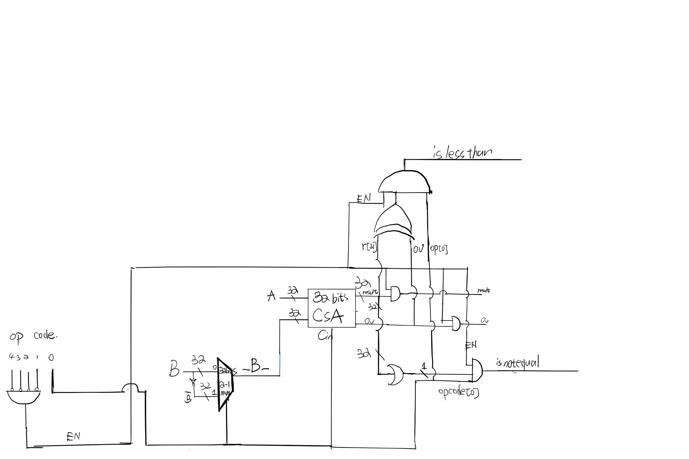

# ECE 550 Proeject checkpoint 2
In this project, a 32-bit ALU, including an arithmetic structure (add, substract and logic operations) and two berral shifters (SLL and SRA), is constructed using Verilog HDL.

## Authors:
Wenjun Zeng
netID: wz165

Xuhui Gong
netID: xg73

# 1. Descriptions:

## 1.1 Structure


The module main structure is as follow:

```
alu
├─ ArithmeticOperator
│      ├─ ADD_SUB_EN
│      │    └─ AND_GATE_4
│      ├─ ADD_SUB_OP
│      │    ├─ MUX_2to1_32B
│      │    └─ NOT_32
│      ├─ Carry_select_adder
│      │    ├─ Mux_36to18
│      │    └─ carry_select_adder_16
│      │           ├─ Mux_10to5
│      │           ├─ Mux_12to6
│      │           ├─ Mux_6to3
│      │           ├─ Mux_8to4
│      │           ├─ full_adder_1
│      │           ├─ ripple_adder_2
│      │           ├─ ripple_adder_3
│      │           ├─ ripple_adder_4
│      │           └─ ripple_adder_5
│      ├─ isNotEqual
│      │    └─ OR_32
│      │           └─ OR_8
│      ├─ islessthan
│      │    └─ AND_3
│      ├─ overflow
│      ├─ logic_and(bitwise AND)
│      └─ logic_or(bitwise OR)
└─ Shifter
       ├─ SLL_32(Logical Left Shift)
       │      └─ mux_2to1_
       └─ SRA_32(Arithmetic right-shift)
       │      └─ mux_2to1
```


# 2. Module

## 2.1 ArithmeticOperator

## 
### 2.1.1 ADD_SUB_EN

Consider the condition that the CSA performs addition and subtraction operations only if the [4:1] of the five-bit opcode is 0000. So we design an enable, i.e. we receive the [4:1] bits of the Op Code, and use NAND Gate to achieve EN high only when the 4:1 bits of the OP code are 0.

EN and Result get the final output by AND gate (If EN is low, it means that the result of the output is always low). In the same way, Overflow, isnotequal and islessthan are also controlled by EN.


### 2.1.2 ADD_SUB_OP

We determine addition and subtraction by accepting the LSB of the OP code (note that because we introduced EN, we don't need to worry about non-additive and subtractive instructions generating output). We use 2 to 1-MUX to control whether to output B or the inverse of B: when the LSB of the OP Code is 0, we pick B and access the CSA's Cin port with the same LSB as the OP Code (0); when the LSB of the OP Code is 1, we pick the inverse of B and access the CSA's Cin port with the same LSB as the OP Code (1);


### 2.1.3 32-bit Carry Select Adder(CSA)

The 32-bit Carry Select Adder(CSA) consists three 16-bit CSA and a 36-to-18 multiplexer.

 The 16-bit CSA is constructed using three 2-bit ripple carry adders (RCA), two 3-bit RCAs, two 4-bit RCAs, two 5-bit RCAs and several multiplexers with various sizes.
The first 2-bit RCAs is used to take the carry_in of the entire 16-bit CSA. While for the other RCAs, every two adders of the same size are connected in parallel and form a block. Each adder in the same block takes a different carry-in (0 or 1) and produce a sum and a carry out (c_out) respectively. The final results (sum and c_out) are selected by the c_out from previous block. 
The schematic of the 16-bit CSA is shown in the following diagram.


The schematic of the 32-bit CSA is shown as follow. As can be seen from the diagram, the first 16-bit sum is directedly calculated from the first 16-bit CSA on the right. The last 16-bit result is selected based on the c-out of the previous CSA. In addition, two more carry bits, namely the carry-in and carry-out of the last digit (31), are also selected from the two CSAs on the left, which will be used to idetify whether the operation is overflow.


### 2.1.4 isNotEqual

By using the truth table we know that the condition of isnotequal is:

OR(result[31:0]) AND (Opcode[0]) AND (EN)


### 2.1.5 isLessThan

By using the truth table we know that the condition of isLessThan is:

(result[31] XOR overflow) AND (EN) AND (Op[0])


### 2.1.6 Overflow

By using the truth table we know that the condition of Overflow is:

C_out[31] XOR C_in[31]

### 2.1.7 Bitwise AND

The Bitwise AND (in logic_and.v) module takes two 32-bit inputs, operand A and operand B, and outputs the bitwise AND result (also 32 bits) of A and B. This module is implemented by a for loop to generate the AND value of each bit in A and B.

### 2.1.8 Bitwise OR

Similiar to Bitwise AND, the Bitwise OR (in logic_or.v) module takes two 32-bit inputs, operand A and operand B, and outputs the bitwise OR result (also 32 bits) of A and B. This module is implemented by a for loop to generate the OR value of each bit in A and B.

## 2.2 Berral Shifter

### 2.2.1 32-bit SLL (Logical Left Shift)

The 32-bit SLL takes a 32-bit operand (denote as _in_) and a 5-bit control (denote as _ctrl_) as inputs, and outputs a 32-bit left-shifted value. The shift amount is specified by ctrl.
The SLL is implemented by _nlogn_ (n is 32 in this case) 2-to-1 multiplexers. The schematic diagram is shown as follow.


There are 5 layers of 2-to-1 multiplexers (MUX) and 32 MUXs is each layer. The layer index corresponds to the bit is ctrl. For example, the 3rd layer controls the 3 bit in ctrl. The intermediate outputs of each layer are fed to the next layer and the outputs of the last layer will be the final output of the SLL. The detailed implementation can be found in SLL_32.v.


### 2.2.2 32-bit SRA(Arithmetic right-shift)

The 32-bit SRA takes a 32-bit operand and a 5-bit control (denote as _ctrl_) as inputs, and outputs a 32-bit Arithmetic right-shift value. 
The schematic diagram is shown as follow.


There are 5 layers of 2-to-1 multiplexers (MUX). The first layer achieves a 1-bit shift, the second layer achieves a 2-bit shift, the third layer achieves a 4-bit shift, the fourth layer achieves an 8-bit shift, and the fifth layer achieves a 16-bit shift. To make sure the complement bit is 1 or 0, we need to get the MSB of the operand and then decide whether to complement 0 or 1 according to the MSB. 


